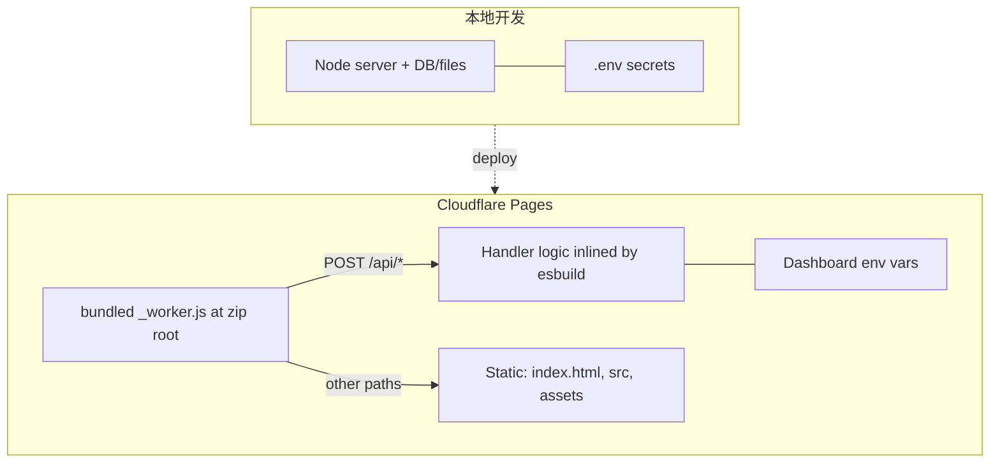

# Cloudflare Pages — 全栈 API 线上部署

## 概述

本地栈：Node 服务 + 本地 DB/文件 + `.env` 密钥。
线上栈：静态资源 + **已打包**的根目录 `_worker.js`，负责将 `/api/*` 路由到处理逻辑，其余路径走 `env.ASSETS.fetch`。

**核心限制：** Dashboard Direct Upload **不会**编译 `functions/`，也**不会**打包 `_worker.js` 里的 ES `import` 语句。未打包的 Worker（~1KB）根本不会执行——站点静默退化为纯静态托管（POST `/api/*` → 405，GET `/api/*` → `index.html`）。

**`.env` 对线上无效：** Cloudflare 运行时通过 Dashboard 环境变量注入密钥，`.env` 文件只作用于本地，永远不会被上传或读取。

## 适用场景

- 本地 API 已跑通，需要部署到 Cloudflare Pages 生产环境
- 生产环境 POST `/api/*` → **405** 或 GET 返回 **index.html**
- Dashboard zip 上传或 Wrangler CLI 部署
- 设置/修改 Production 环境变量

**不适用：** 纯本地开发、仅改前端静态内容、非 Cloudflare 托管。

## 架构



## 核心结构

源码仓库典型布局：

```
_worker.js          # imports from functions/api/*.js — must be esbuild-bundled for Dashboard zip
_routes.json        # routing hints — alone does NOT activate API on Direct Upload
functions/api/      # shared handler source — ignored by Dashboard zip unless inlined into _worker.js
index.html, src/, assets/
```

**Direct Upload zip 必须包含：** 根目录放 esbuild 打包后的 `_worker.js`（通常 10–50KB，零 `import` 语句）+ 静态资源 + `_routes.json`。**不要**依赖 zip 内的 `functions/`。

打包命令：
```bash
esbuild _worker.js --bundle --format=esm --outfile=.pages-build/_worker.js
# Workers 运行时 ≠ Node：避免使用 Node 内置模块（fs、path、crypto）。
# 如有需要：加 --platform=browser，或替换为 CF 兼容的方案。
```
然后将静态资源复制进来并打 zip。Wrangler 会自动打包，无需手动 zip。

## 快速参考

| 操作 | 命令 / 步骤 |
|------|------------|
| 构建 Dashboard zip | `npm run build:pages-zip` 或 `./scripts/build-pages-upload-zip.sh` |
| Wrangler 部署 | `npx wrangler login` → `npm run deploy:pages` |
| 检查 zip 内容 | `unzip -l pages-upload.zip` — 确认根目录有 `_worker.js`，大小 ≫ 2KB |

## 部署步骤

1. **设置环境变量（Production）** — Pages Dashboard → Settings → Environment variables。`.env` 仅限本地，永远不会上传；Cloudflare 运行时只读 Dashboard 变量，改完必须重新部署才能生效。
2. **构建 zip（Dashboard 路径）** — 每次都重新跑构建脚本，确认 Worker 文件大小和无 `import`。
3. **上传** — Pages → **Create deployment** → 上传 zip。必须用 **Create**，不能用 **Retry**（Retry 会重放旧 artifact）。
4. **Wrangler 路径（替代方案）** — `wrangler pages deploy`，在 `wrangler.toml` 里配 `pages_build_output_dir`；环境变量仍在 Dashboard 里设。
5. **验证**

```bash
curl -sS -X POST "https://<project>.pages.dev/api/chat" \
  -H "Content-Type: application/json" \
  -d '{"text":"hello"}'
# 期望：200 JSON，不是 405

curl -sS "https://<project>.pages.dev/api/chat"
# 期望：JSON 错误或 API 响应——不是 index.html
```

Edge 环境没有本地 DB，预期返回无状态响应。

## 诊断顺序

**线上出问题时，按此顺序逐步确认，不要跳步。** 每一步对应下方"常见错误"表中的具体修复方法。

1. **检查 Worker 包** — zip 根目录的 `_worker.js` 是否 ≫ 2KB 且无 `import`？否则 → 重新用 esbuild 打包。
2. **检查部署方式** — 是否用了 **Create deployment**（新 zip）而非 **Retry**（重放旧 artifact）？否则 → 重新创建部署。
3. **检查环境变量** — Dashboard 的 Production 变量是否已设，且设完之后有重新部署？否则 → 设变量 + 重新部署。
4. **检查项目名** — Pages 项目名/域名是否与 `wrangler.toml` 的 `name` 一致？否则 → 确认操作的是正确项目。
5. **最后才排查 CORS / 业务逻辑** — 前四项全部确认无误后再查。

## 常见错误

| 症状 / 误判 | 实际原因与修复 |
|------------|--------------|
| POST → 405 | 上传了未打包的 `_worker.js`。用 esbuild 重建；根目录文件应 ≫ 2KB，无 `import`。 |
| GET `/api/*` → index.html | Worker 未激活——同上，打包修复。 |
| 认为 `_routes.json` 足够 | Direct Upload 不够；Worker 必须预先打包。 |
| `_routes.json` 里写了 `"fallback": true` | 所有未匹配路径回落静态，Worker 不处理 `/api/*`。删除此项或改为 `"none"`。 |
| 用了 Finder/Downloads 里的旧 zip | 过期 artifact。每次上传前必须重新构建。 |
| **Retry deployment** | 重放旧 artifact。必须用 **Create deployment** 上传新 zip。 |
| zip 里放了 `functions/` | Dashboard 忽略它；逻辑必须内联进打包后的 `_worker.js`。 |
| 改了 `.env`，线上 API 还是不对 | `.env` 对 Cloudflare 无效；在 Dashboard 设变量 + 重新部署。 |
| 改了环境变量但没重新部署 | Production 变量在部署时绑定；必须触发新 deployment。 |
| 操作了错误的 Pages 项目 | 确认 Dashboard 项目名与 `wrangler.toml` `name` 一致。 |
| 把 405 先归因于 CORS | 先检查 Worker 包——Worker 未激活才是 405/静态回落的根本原因。 |

## 危险信号

- `_worker.js` 小于 ~2KB 或包含 `import` / `from "./functions"`
- 认为 Wrangler 和 Dashboard zip 在不打包的情况下行为一致
- 直接把仓库根目录打 zip 上传，没有构建步骤
- 变量"已经设过"但 API key 仍缺失——环境作用域不对，或变量改完没有重新部署

---

## 背景与根因

**背景：** 本地有可运行的 Node 全栈应用（聊天 API、SQLite、`.env` 网关密钥），需要把 `/api/chat` 部署到 Cloudflare Pages 生产环境。

**哪些操作会出错：**

- 以为 `_routes.json` 足以让 `/api/*` 走 Worker
- 把含 `functions/` 或未打包的 `_worker.js`（带 `import`）直接打进 zip
- 用 **Retry deployment** 而非 **Create deployment** 上传新包
- 认为改 `.env` 就能影响线上 Cloudflare
- 混淆不同 Pages 项目（如 v2 vs v3 域名/项目名）
- 未打包的 `_worker.js` 只有几百字节，Cloudflare 无法执行，站点退化为纯静态
- 把 405 先归因于 CORS，而非 Worker 未激活
- 环境变量改完未重新部署

**成功部署的样子：**

- zip 根目录有 esbuild 单文件打包的 `_worker.js`，通常 10KB+，零 `import`
- 静态资源 + `_routes.json` 同在 zip 根目录，不依赖 zip 内的 `functions/`
- Dashboard Production 环境变量已配置，且部署后生效
- 通过 **Create deployment** 上传新鲜构建的 zip，或用 Wrangler 自动 bundle 部署
- `curl -X POST https://<host>/api/chat` 返回 200 JSON

**技术根因：** Cloudflare Pages Direct Upload [不编译 `functions/`](https://developers.cloudflare.com/pages/get-started/direct-upload/#functions)，也不打包 `_worker.js` 里的 ES module `import`。源码级 Worker 上传后不会运行，请求落回静态托管。Wrangler 部署时自动 bundle；Dashboard 路径必须本地 esbuild 预打包。环境变量在 Workers/Pages 运行时注入，与 `.env` 和 Git 无关，变更需新 deployment 才能绑定。

*实际案例：某聊天应用通过 `scripts/build-pages-upload-zip.sh` → esbuild 打包 → Dashboard Create deployment 完成上线。*
